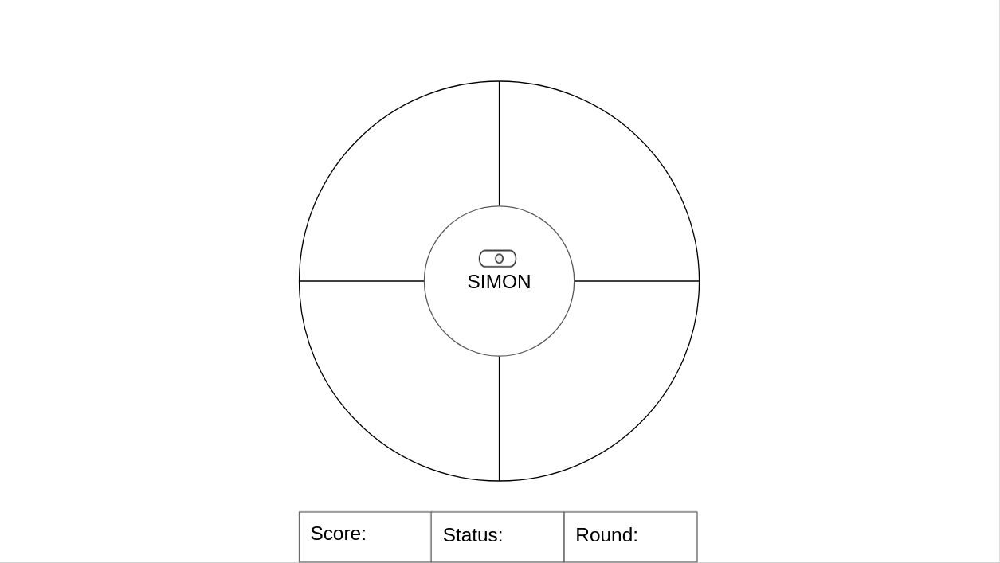

# Simon-Game

This is my first coding project which consists of game similar to Simon (Hasbro Light up Game) which is a exciting electronic game of lights and sounds where a player presses colored buttons to match a random sequence provided by Simon. If the player repeats the pattern successfully one more light is added to the pattern, each time the player repeats the sequence successfully. If the player fails to enter the sequence correctly the game is over. The game will have 8 rounds. The game will keep track of score, status (good/win/gameover), and a round number.

## Screenshot of Application

Screenshot seen below:

## Technologies Used

HTML, CSS and JavaScript

## Installation Instructions

Fork and clone the repository in terminal.
cd into the folder that contains repository.
Open the entire folder in VScode.
In terminal open all code in VSCode using "code .".
Open the index.html file in your browser.
You can do this by going to explorer window and then left clicking on index.html, then hold and drag index.html on to the address bar.
You should see the address bar display location of the html file for example: "/home/panamabilly/sei/project/Simon-Game/index.html"
Cick on About the Game button to learn the game rules, you can click the button on the Simon board to start the game.
Start playing!

## User Stories

The users of this app are people that want to play a casual game of SIMON in a browser.

1. As a player, I want to see the instructions/intro on how to play the game, so that the player knows the rules and systems in the game.
2. As a player, I want to start the game on a press of a button, so that the player knows the game has started.
3. As a player, I want to see my score on the screen, so that the player can keep track progress.
4. As a player, I want to see on the status on the screen, so that the player knows that the sequence entered is correct or wrong.
5. As a player, I want to see on the round number on the screen, so the player knows what round/level they are on in the game.
6. As a player, I want to see a starting light sequence before game begins, so that the player knows the game is about to start.
7. As a player, I want to hear some notes that go along with the starting light sequence, so the player has an audio queue to go along with the visual queue.
8. As a player, I want to hear a sound either when I press a button or a button is lit up by Simon, so the player has a audio queue to go along with the visual queue.
9. As a player, I want to hear a error sound when a wrong entry has been entered into the repeat sequence, so the player knows he did a mistake and also knows that the game is over.
10. As a player, I want to see some confetti explode all over the screen after I have won, so that the player is satisfied after beating the game.

## Wireframes

Modal Screen

Gameboard Screen

Winner Screen

## Unsolved Problems/Major Hurdles/Lessons Learned

Unsolved Problems

1. I would like for the Simon game to repeat the entire computer light up sequence after the player passes a round. Right now only the next light in the sequence activated.
2. I would like to add soundsthat follows the light flashes and errors in input like the original gameboard.
3. I would like to add a special effect to the screen after winning the game.

Major Hurdles

1. The flashing of the Computer's Color Sequence was a major hurdle because I couldn't get the player and computer player array to match for the conditional statements to to comma formatting.
2. The setting up of the Timeout functions so the flashes didn't look out of order was difficult accomplish which only needed to be multiplied by the timeot time interval.
3. The checking of the computer vs the player sequence was also a challenge, mainly the planning of the logic for that.
4. After winning the game there was a hurdle of displaying something for the player to see after they win I opted to just use some of the random light sequences to show that the player won because everytime I the game was won a light would turn on even after winning, This was due to how the checking of the computer and player color sequence was programmed. The random winning lights were used to mask this effect.

Lessons Learned

Learned to how to plan out how to develop a simple program, and implement a vision for a game and code according to the needs.

## Link to Project's Github Repository.

https://github.com/panamabilly/Simon-Game
